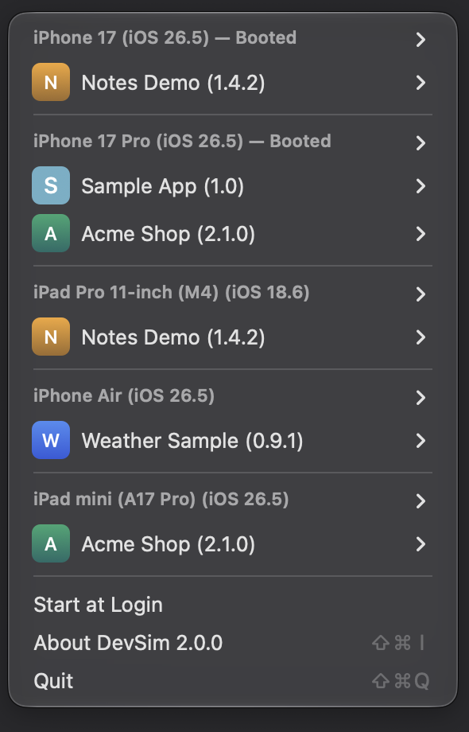
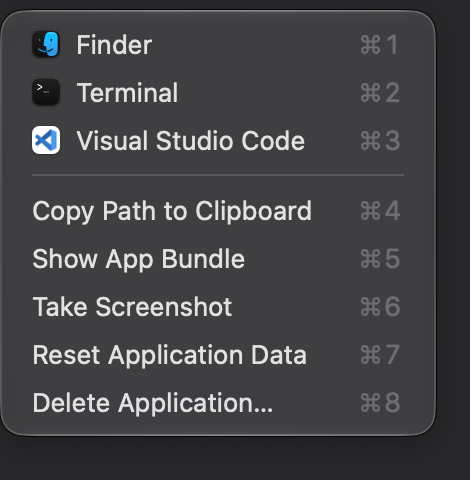
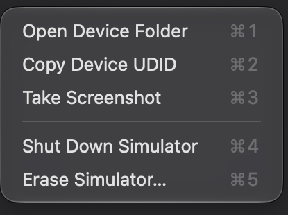

# DevSim

A menu bar app for jumping straight into iOS/watchOS/tvOS simulator app folders.

Click the menu bar icon, pick an app, land in its container.

<p align="center">
  
  &nbsp;
  
  &nbsp;
  
</p>

## Requirements

- macOS 13 Ventura or later
- Xcode command line tools (for the Swift toolchain and `simctl`)

## Build and install

```bash
Scripts/build-app.sh --install
```

That compiles a release build, assembles `DevSim.app`, renders the icon, ad-hoc signs the
bundle, copies it to `/Applications` and launches it. Leave off `--install` to build into
`./build` without touching `/Applications`.

To work on it in Xcode, open `Package.swift`. Running the scheme launches the menu bar
app directly — no bundle needed.

## Using it

Click the menu bar icon. Each booted or recently used simulator gets a section, listing
the apps you have installed on it, then its app groups and app extensions.

Clicking an app row opens its data container in Finder. Hold a modifier to change that:

| Modifier | Opens in |
| --- | --- |
| — | Finder |
| ⌥ | Terminal |
| ⌃ | Commander One (when installed) |

### App actions

Each app, app group and app extension row has a submenu:

- **Finder / Terminal / iTerm / Ghostty / Warp / VS Code / …** — whichever of the supported
  file managers, terminals and editors are installed on this Mac
- **TablePlus / DB Browser / Realm Studio** — shown when the container holds `.sqlite`,
  `.store`, `.db` or `.realm` files, opening them in whichever viewer you have
- **Copy Path to Clipboard**
- **Show App Bundle** — reveals the installed `.app` itself
- **Take Screenshot** — `simctl` screenshot of a booted simulator, saved to the Desktop
- **Reset Application Data** — deletes Documents, Library and tmp, leaving the app installed
- **Delete Application** — uninstalls the app from that simulator entirely

### Simulator actions

The simulator row itself opens the device folder, and its submenu holds device-level
actions:

- **Open Device Folder** / **Copy Device UDID**
- **Take Screenshot**
- **Boot Simulator** / **Shut Down Simulator**
- **Erase Simulator** — erases all content and settings, the same as Simulator's own
  Erase All Content and Settings

Deleting an app and erasing a simulator both ask for confirmation first, and both run in
the background — the menu bar icon dims while `simctl` is working.

`simctl` is particular about device state, so DevSim moves the device where it needs to be
and puts it back afterwards. Deleting an app from a shut down simulator boots it, uninstalls,
and shuts it down again; erasing a booted simulator shuts it down, erases, and boots it
again. A cold boot takes the better part of a minute, so those operations are not instant.

### Troubleshooting

`DevSim --dump-menu` prints the same menu as text, which is handy when something is not
showing up where you expect it.

## Notes on behaviour

- **Simulator discovery** walks `~/Library/Developer/CoreSimulator/Devices` directly rather
  than reading the Simulator.app preferences file, so devices booted by `xcodebuild` or
  `simctl` show up too. Booted devices sort first, and devices with no apps installed never
  take a slot.
- **App icons** come from the rendered variants Xcode copies to the bundle root. Apps whose
  icon only lives in `Assets.car`, and apps with no icon at all, get a generated letter tile.
- **Not sandboxed.** Resetting app data, deleting apps and erasing simulators all need write
  access to `~/Library/Developer`, which the App Sandbox does not grant.

## Layout

```
Sources/DevSim/
  main.swift            entry point (also handles --dump-menu)
  AppDelegate.swift     status item and menu lifecycle
  Settings.swift        login item, via SMAppService
  Models/               Simulator, Application, AppGroup, AppExtension
  Services/             scanning, filesystem, icon loading, app lookup, simctl
  UI/                   menu construction and menu item actions
Scripts/
  build-app.sh          builds and optionally installs DevSim.app
  make-icon.swift       renders AppIcon.icns
```

## License

MIT. See [LICENSE](LICENSE).

---

DevSim's menu and workflow are based on [SimSim](https://github.com/dsmelov/simsim) by
Daniil Smelov.
